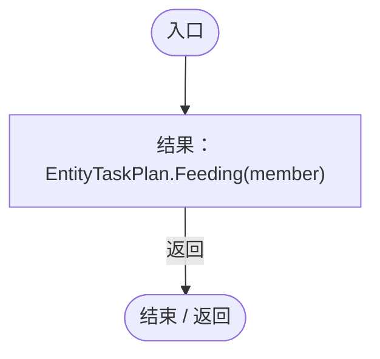
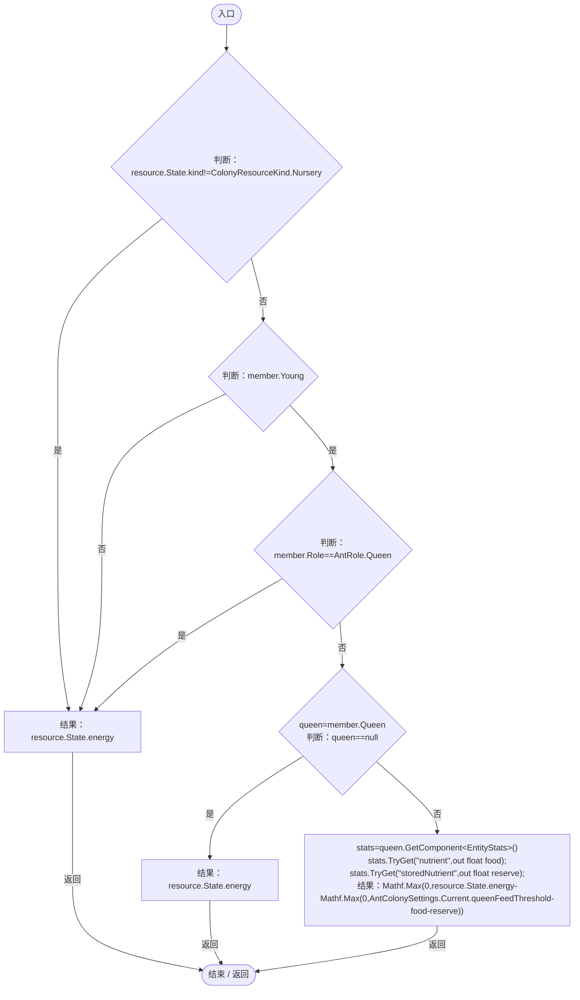

# ColonyFeeding.cs

[返回总索引](../README.md) · `Runtime` · `Assets/DarwinPark/Entities/Ecology/ColonyFeeding.cs`

[源文件](../../../Assets/DarwinPark/Entities/Ecology/ColonyFeeding.cs) · 源码校验：`339620ea6cd677eda57820f1e077a484c0c20e4817a71e9b24e20760cb3e9043`

方法按源文件位置排列。事件/回调引用不表示立即执行；分支与异常说明见总索引。完整源码与可点击关系图请打开离线手册。

## WantsFood · L10

`public static bool WantsFood(AntColonyMember member)`

★ 适配：所有消费和寻路入口读取同一份持久化计划。

### Editor / Player · Roslyn编译器控制流

```mermaid
flowchart TD
  b0(["入口"])
  b1["结果：EntityTaskPlan.Feeding(member)"]
  b2(["结束 / 返回"])
  b0 --> b1
  b1 -->|"返回"| b2

```

项目内调用/回调引用：

- [EntityTaskPlan.Feeding · L17](da041665b1125ffc.md#m8620682dd404eff9)（方法）

## Find · L11

`public static ColonyResource Find(AntColonyMember member,bool nearbyOnly)`

### Editor / Player · Roslyn编译器控制流

```mermaid
flowchart TD
  b0(["入口"])
  b1{"判断：WantsFood(member)"}
  b2["结果：null"]
  b3{"判断：member.Role==AntRole.Queen"}
  b4{"判断：member.Young"}
  b5["ColonyResourceKind.Nursery"]
  b6["ColonyResourceKind.Supply"]
  b7["kind=member.Role==AntRole.Queen&#124;&#124;member.Young?ColonyResourceKind.Nursery:ColonyResourceKind.Supply"]
  b8{"locked=ColonyResource.Find(member.State.plan.supply)<br/>判断：locked!=null"}
  b9{"判断：locked.State.kind==kind"}
  b10{"判断：locked.State.kind==ColonyResourceKind.Energy"}
  b11{"判断：ColonyResourceOwnership.Available(locked,member)"}
  b12{"判断：AvailableEnergy(locked,member)&gt;0"}
  b13{"判断：nearbyOnly"}
  b14{"判断：EcologyQueries.Distance(locked.transform.position,member.transform.position)&lt;=AntColonySettings.Current.feedRadius"}
  b15["locked"]
  b16["null"]
  b17["结果：!nearbyOnly&#124;&#124;EcologyQueries.Distance(locked.transform.position,member.transform.position)&lt;=AntColonySettings.Current.feedRadius?locked:null"]
  b18["member.State.plan.supply=null;<br/>nearest=null<br/>best=float.PositiveInfinity<br/>point=member.transform.position"]
  b19["ColonyResource.All"]
  b20{"判断：ColonyResource.All"}
  b21["var"]
  b22{"判断：resource.State.kind!=kind"}
  b23{"判断：resource.State.kind!=ColonyResourceKind.Energy"}
  b24{"判断：ColonyResourceOwnership.Available(resource,member)"}
  b25{"判断：AvailableEnergy(resource,member)&lt;=0"}
  b26{"distance=(resource.transform.position-point).sqrMagnitude<br/>判断：distance&gt;=best"}
  b27{"判断：nearbyOnly"}
  b28{"判断：EcologyQueries.Distance(resource.transform.position,point)&gt;AntColonySettings.Current.feedRadius"}
  b29["best=distance;<br/>nearest=resource;"]
  b30{"判断：ColonyResource.All"}
  b31["ColonyResource.All"]
  b32["连接 / 离开区域"]
  b33{"判断：nearest!=null"}
  b34["member.State.plan.supply=nearest.State.id;"]
  b35["结果：nearest"]
  b36(["结束 / 返回"])
  b0 --> b1
  b1 -->|"否"| b2
  b1 -->|"是"| b3
  b2 -->|"返回"| b36
  b3 -->|"否"| b4
  b3 -->|"是"| b5
  b4 -->|"是"| b5
  b4 -->|"否"| b6
  b5 --> b7
  b6 --> b7
  b7 --> b8
  b8 -->|"是"| b9
  b8 -->|"否"| b18
  b9 -->|"否"| b10
  b9 -->|"是"| b11
  b10 -->|"是"| b11
  b10 -->|"否"| b18
  b11 -->|"是"| b12
  b11 -->|"否"| b18
  b12 -->|"是"| b13
  b12 -->|"否"| b18
  b13 -->|"是"| b14
  b13 -->|"否"| b15
  b14 -->|"是"| b15
  b14 -->|"否"| b16
  b15 --> b17
  b16 --> b17
  b17 -->|"返回"| b36
  b18 --> b19
  b19 --> b20
  b20 -->|"是"| b21
  b20 -->|"否 · 经过finally 30"| b33
  b21 --> b22
  b22 -->|"是"| b23
  b22 -->|"否"| b24
  b23 -->|"否"| b24
  b23 -->|"是"| b20
  b24 -->|"是"| b25
  b24 -->|"否"| b20
  b25 -->|"是"| b20
  b25 -->|"否"| b26
  b26 -->|"否"| b27
  b26 -->|"是"| b20
  b27 -->|"是"| b28
  b27 -->|"否"| b29
  b28 -->|"是"| b20
  b28 -->|"否"| b29
  b29 --> b20
  b30 -->|"否"| b31
  b30 -->|"是"| b32
  b31 --> b32
  b33 -->|"是"| b34
  b33 -->|"否"| b35
  b34 --> b35
  b35 -->|"返回"| b36
  b20 -. "退出保护区时 finally（示意）" .-> b30

```

项目内调用/回调引用：

- [ColonyFeeding.WantsFood · L10](2cb56c08d08ff8ec.md#m56d2edeb3860f143)（方法）
- [AntColonyMember.Role.get · L38](baebd85c05598377.md#mab30d459d599e4df)（访问器）
- [ColonyResource.Find · L27](293dbaecfff4b585.md#m67d4286733d518a2)（方法）
- [AntColonyMember.State.get · L32](baebd85c05598377.md#m426db6a7c12dd7aa)（访问器）
- [ColonyResource.State.get · L23](293dbaecfff4b585.md#m65ff21bb6da1a2da)（访问器）
- [ColonyResourceOwnership.Available · L23](2988679fde59fc87.md#ma3b7caf13a1f8423)（方法）
- [ColonyFeeding.AvailableEnergy · L30](2cb56c08d08ff8ec.md#m86c0102b78f1cf4c)（方法）
- [EcologyQueries.Distance · L42](bdf7ccc2c9c0452f.md#mba9c3e3c95d0f2dd)（方法）
- [AntColonySettings.Current.get · L31](cb0a937e97c8fbb3.md#mcd121159f407ccdf)（访问器）

## AvailableEnergy · L30

`public static float AvailableEnergy(ColonyResource resource,AntColonyMember member)`

### Editor / Player · Roslyn编译器控制流

```mermaid
flowchart TD
  b0(["入口"])
  b1{"判断：resource.State.kind!=ColonyResourceKind.Nursery"}
  b2{"判断：member.Young"}
  b3{"判断：member.Role==AntRole.Queen"}
  b4["结果：resource.State.energy"]
  b5{"queen=member.Queen<br/>判断：queen==null"}
  b6["结果：resource.State.energy"]
  b7["stats=queen.GetComponent&lt;EntityStats&gt;()<br/>stats.TryGet(&quot;nutrient&quot;,out float food);<br/>stats.TryGet(&quot;storedNutrient&quot;,out float reserve);<br/>结果：Mathf.Max(0,resource.State.energy-Mathf.Max(0,AntColonySettings.Current.queenFeedThreshold-food-reserve))"]
  b8(["结束 / 返回"])
  b0 --> b1
  b1 -->|"否"| b2
  b1 -->|"是"| b4
  b2 -->|"是"| b3
  b2 -->|"否"| b4
  b3 -->|"是"| b4
  b3 -->|"否"| b5
  b4 -->|"返回"| b8
  b5 -->|"是"| b6
  b5 -->|"否"| b7
  b6 -->|"返回"| b8
  b7 -->|"返回"| b8

```

项目内调用/回调引用：

- [ColonyResource.State.get · L23](293dbaecfff4b585.md#m65ff21bb6da1a2da)（访问器）
- [AntColonyMember.Role.get · L38](baebd85c05598377.md#mab30d459d599e4df)（访问器）
- [EntityStats.TryGet · L90](75aa86a368efdf24.md#m24ee1433e4a70d94)（方法）
- [AntColonySettings.Current.get · L31](cb0a937e97c8fbb3.md#mcd121159f407ccdf)（访问器）

## Destination · L38

`public static bool Destination(AntColonyMember member,out Vector3 point)`

### Editor / Player · Roslyn编译器控制流

```mermaid
flowchart TD
  b0(["入口"])
  b1["resource=Find(member,false)"]
  b2{"point<br/>判断：resource!=null"}
  b3["resource.transform.position"]
  b4["member.transform.position"]
  b5["point=resource!=null?resource.transform.position:member.transform.position;"]
  b6{"判断：resource==null"}
  b7["结果：false"]
  b8{"point<br/>判断：EcologyQueries.Distance(member.transform.position,point)&lt;=AntColonySettings.Current.feedRadius"}
  b9["member.transform.position"]
  b10["ColonyFormation.Home(member,point,AntColonySettings.Current.feedRadius*.65f)"]
  b11["point=EcologyQueries.Distance(member.transform.position,point)&lt;=AntColonySettings.Current.feedRadius?member.transform.position:ColonyFormation.Home(member,point,AntColonySettings.Current.feedRadius*.65f);"]
  b12["member.Activity=ColonyActivity.Feed;<br/>结果：true"]
  b13(["结束 / 返回"])
  b0 --> b1
  b1 --> b2
  b2 -->|"是"| b3
  b2 -->|"否"| b4
  b3 --> b5
  b4 --> b5
  b5 --> b6
  b6 -->|"是"| b7
  b6 -->|"否"| b8
  b7 -->|"返回"| b13
  b8 -->|"是"| b9
  b8 -->|"否"| b10
  b9 --> b11
  b10 --> b11
  b11 --> b12
  b12 -->|"返回"| b13

```

项目内调用/回调引用：

- [ColonyFeeding.Find · L11](2cb56c08d08ff8ec.md#mfea041f7d0713775)（方法）
- [EcologyQueries.Distance · L42](bdf7ccc2c9c0452f.md#mba9c3e3c95d0f2dd)（方法）
- [AntColonySettings.Current.get · L31](cb0a937e97c8fbb3.md#mcd121159f407ccdf)（访问器）
- [ColonyFormation.Home · L36](c65dce2d54e43480.md#m79ad3420baeaf49d)（方法）
- [AntColonyMember.Activity.set · L50](baebd85c05598377.md#m5ded02c2888b0b4d)（访问器）
