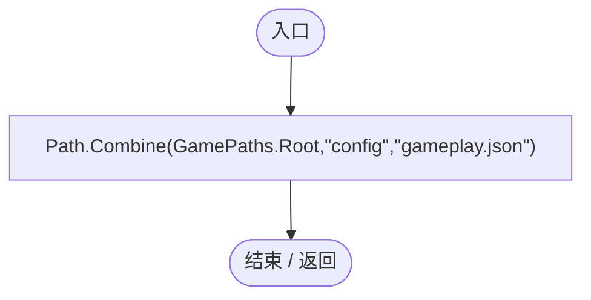
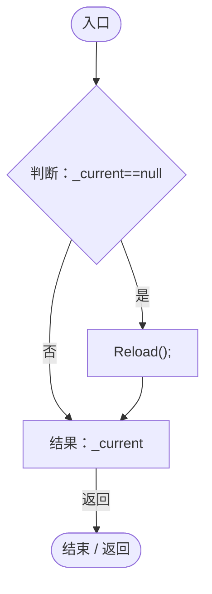
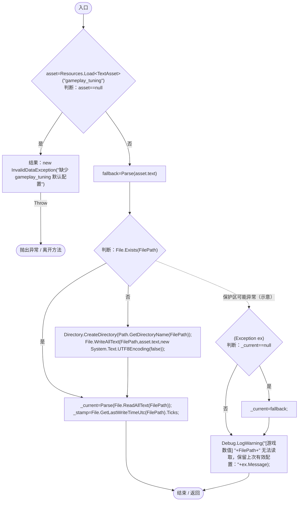
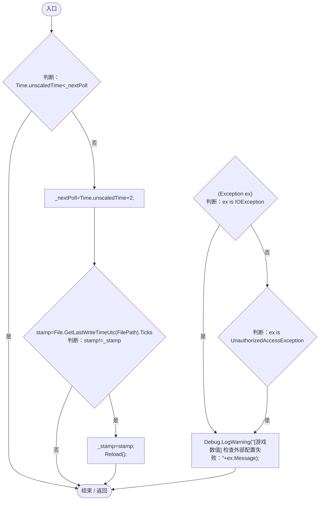

# GameplayTuning.cs

[返回总索引](../README.md) · `Runtime` · `Assets/DarwinPark/Core/GameplayTuning.cs`

[源文件](../../../Assets/DarwinPark/Core/GameplayTuning.cs) · 源码校验：`0342e5f23eec0978d4705f3baa2638dda5d51a93b66710524741552c211dd3e4`

方法按源文件位置排列。事件/回调引用不表示立即执行；分支与异常说明见总索引。完整源码与可点击关系图请打开离线手册。

## FilePath.get · L43

`public static string FilePath`

### Editor / Player · 语法控制结构 / 声明（非CFG）

```mermaid
flowchart TD
  n2(["入口"])
  n1["Path.Combine(GamePaths.Root,&quot;config&quot;,&quot;gameplay.json&quot;)"]
  n0(["结束 / 返回"])
  n1 --> n0
  n2 --> n1

```

## Current.get · L44

`get`

### Editor / Player · Roslyn编译器控制流

```mermaid
flowchart TD
  b0(["入口"])
  b1{"判断：_current==null"}
  b2["Reload();"]
  b3["结果：_current"]
  b4(["结束 / 返回"])
  b0 --> b1
  b1 -->|"是"| b2
  b1 -->|"否"| b3
  b2 --> b3
  b3 -->|"返回"| b4

```

项目内调用/回调引用：

- [GameplayTuning.Reload · L59](db546e5713b32d53.md#m08a291b1e79e7088)（方法）

## Parse · L45

`public static GameplayTuning Parse(string json)`

### Editor / Player · Roslyn编译器控制流

```mermaid
flowchart TD
  b0(["入口"])
  b1{"value=JsonUtility.FromJson&lt;GameplayTuning&gt;(CommentedJson.Strip(json))<br/>判断：value==null"}
  b2{"判断：value.version!=1"}
  b3["结果：new InvalidDataException(&quot;游戏数值配置版本无效&quot;)"]
  x3(["抛出异常 / 离开方法"])
  b4{"判断：value.mutationMode&lt;0"}
  b5{"判断：value.mutationMode&gt;1"}
  b6{"判断：value.stageMutationProbability&gt;1"}
  b7{"判断：value.stageEnvironmentBoost&gt;1"}
  b8{"判断：value.corpseCleanupSeconds&lt;1"}
  b9{"判断：value.corpseCleanupSeconds&gt;86400"}
  b10{"判断：value.corpseCleanupPerFrame&lt;1"}
  b11{"判断：value.corpseCleanupPerFrame&gt;4096"}
  b12["结果：new InvalidDataException(&quot;变异模式、阶段概率或尸体清理周期/预算无效&quot;)"]
  x12(["抛出异常 / 离开方法"])
  b13{"判断：value.mergePhaseBuckets&lt;1"}
  b14{"判断：value.mergePhaseBuckets&gt;256"}
  b15["结果：new InvalidDataException(&quot;合并错峰批次数必须为1到256&quot;)"]
  x15(["抛出异常 / 离开方法"])
  b16{"判断：value.colonyEmergencyFeedThreshold&gt;10"}
  b17["结果：new InvalidDataException(&quot;紧急补给饱食线必须为0到10&quot;)"]
  x17(["抛出异常 / 离开方法"])
  b18{"判断：value.mutationPopulationFraction&gt;1"}
  b19{"判断：value.mutationRoundSeconds&lt;1"}
  b20{"判断：value.mutationRoundSeconds&gt;86400"}
  b21["结果：new InvalidDataException(&quot;全局变异比例须为0到1，轮次周期须为1到86400模拟秒&quot;)"]
  x21(["抛出异常 / 离开方法"])
  b22["typeof(GameplayTuning).GetFields()"]
  b23{"判断：typeof(GameplayTuning).GetFields()"}
  b24{"var<br/>判断：field.FieldType==typeof(float)"}
  b25{"n=(float)field.GetValue(value)<br/>判断：float.IsNaN(n)"}
  b26{"判断：float.IsInfinity(n)"}
  b27{"判断：n&lt;0"}
  b28["结果：new InvalidDataException(&quot;数值必须为非负有限数：&quot;+field.Name)"]
  x28(["抛出异常 / 离开方法"])
  b29{"typeof(GameplayTuning).GetFields()<br/>判断：typeof(GameplayTuning).GetFields()"}
  b30["typeof(GameplayTuning).GetFields()"]
  b31["连接 / 离开区域"]
  b32{"判断：value.manualHitboxScale&lt;1"}
  b33{"判断：value.supplyActivityRadiusRatio&lt;=0"}
  b34{"判断：value.colonyActivityRadiusMultiplier&lt;=0"}
  b35{"判断：value.populationFillOpacity&gt;1"}
  b36["结果：new InvalidDataException(&quot;判定框倍率至少为1，活动半径倍率必须大于0，透明度须在0到1之间&quot;)"]
  x36(["抛出异常 / 离开方法"])
  b37{"判断：value.mergeMaximumCatchupSeconds&lt;value.mergeInterval"}
  b38{"判断：value.mergeMaximumCatchupSeconds&gt;30"}
  b39{"判断：value.colonyBirthReservedSlots&gt;32"}
  b40{"判断：value.colonySuccessorPopulation&lt;1"}
  b41{"判断：value.colonySuccessorPopulation&gt;100000"}
  b42{"判断：value.mergeFoodTolerance&lt;.001f"}
  b43{"判断：value.mergeFoodTolerance&gt;10"}
  b44{"判断：value.mergeReserveTolerance&lt;.001f"}
  b45{"判断：value.mergeWakeDistance&lt;=0"}
  b46{"判断：value.memberFeedResume&gt;10"}
  b47{"判断：value.mergeRadius&lt;=0"}
  b48{"判断：value.mergeInterval&lt;.1f"}
  b49{"判断：value.mergeInterval&gt;2"}
  b50{"判断：value.mergeMaximumMembers&lt;1"}
  b51{"判断：value.mergeMaximumMembers&gt;128"}
  b52{"判断：value.mergeGroupsPerFrame&lt;1"}
  b53{"判断：value.mergeGroupsPerFrame&gt;100000"}
  b54{"判断：value.mutationAttemptsPerFrame&lt;1"}
  b55{"判断：value.mutationAttemptsPerFrame&gt;100000"}
  b56{"判断：value.mergedMutationFraction&gt;1"}
  b57{"判断：value.multipleBirthMaximum&lt;1"}
  b58{"判断：value.multipleBirthMaximum&gt;16"}
  b59["结果：new InvalidDataException(&quot;任务或合并计算数值超出有效范围&quot;)"]
  x59(["抛出异常 / 离开方法"])
  b60["结果：value"]
  b61(["结束 / 返回"])
  b0 --> b1
  b1 -->|"否"| b2
  b1 -->|"是"| b3
  b2 -->|"是"| b3
  b2 -->|"否"| b4
  b3 -->|"Throw"| x3
  b4 -->|"否"| b5
  b4 -->|"是"| b12
  b5 -->|"否"| b6
  b5 -->|"是"| b12
  b6 -->|"否"| b7
  b6 -->|"是"| b12
  b7 -->|"否"| b8
  b7 -->|"是"| b12
  b8 -->|"否"| b9
  b8 -->|"是"| b12
  b9 -->|"否"| b10
  b9 -->|"是"| b12
  b10 -->|"否"| b11
  b10 -->|"是"| b12
  b11 -->|"是"| b12
  b11 -->|"否"| b13
  b12 -->|"Throw"| x12
  b13 -->|"否"| b14
  b13 -->|"是"| b15
  b14 -->|"是"| b15
  b14 -->|"否"| b16
  b15 -->|"Throw"| x15
  b16 -->|"是"| b17
  b16 -->|"否"| b18
  b17 -->|"Throw"| x17
  b18 -->|"否"| b19
  b18 -->|"是"| b21
  b19 -->|"否"| b20
  b19 -->|"是"| b21
  b20 -->|"是"| b21
  b20 -->|"否"| b22
  b21 -->|"Throw"| x21
  b22 --> b23
  b23 -->|"是"| b24
  b23 -->|"否 · 经过finally 29"| b32
  b24 -->|"是"| b25
  b24 -->|"否"| b23
  b25 -->|"否"| b26
  b25 -->|"是"| b28
  b26 -->|"否"| b27
  b26 -->|"是"| b28
  b27 -->|"是"| b28
  b27 -->|"否"| b23
  b28 -->|"Throw"| x28
  b29 -->|"否"| b30
  b29 -->|"是"| b31
  b30 --> b31
  b32 -->|"否"| b33
  b32 -->|"是"| b36
  b33 -->|"否"| b34
  b33 -->|"是"| b36
  b34 -->|"否"| b35
  b34 -->|"是"| b36
  b35 -->|"是"| b36
  b35 -->|"否"| b37
  b36 -->|"Throw"| x36
  b37 -->|"否"| b38
  b37 -->|"是"| b59
  b38 -->|"否"| b39
  b38 -->|"是"| b59
  b39 -->|"否"| b40
  b39 -->|"是"| b59
  b40 -->|"否"| b41
  b40 -->|"是"| b59
  b41 -->|"否"| b42
  b41 -->|"是"| b59
  b42 -->|"否"| b43
  b42 -->|"是"| b59
  b43 -->|"否"| b44
  b43 -->|"是"| b59
  b44 -->|"否"| b45
  b44 -->|"是"| b59
  b45 -->|"否"| b46
  b45 -->|"是"| b59
  b46 -->|"否"| b47
  b46 -->|"是"| b59
  b47 -->|"否"| b48
  b47 -->|"是"| b59
  b48 -->|"否"| b49
  b48 -->|"是"| b59
  b49 -->|"否"| b50
  b49 -->|"是"| b59
  b50 -->|"否"| b51
  b50 -->|"是"| b59
  b51 -->|"否"| b52
  b51 -->|"是"| b59
  b52 -->|"否"| b53
  b52 -->|"是"| b59
  b53 -->|"否"| b54
  b53 -->|"是"| b59
  b54 -->|"否"| b55
  b54 -->|"是"| b59
  b55 -->|"否"| b56
  b55 -->|"是"| b59
  b56 -->|"否"| b57
  b56 -->|"是"| b59
  b57 -->|"否"| b58
  b57 -->|"是"| b59
  b58 -->|"是"| b59
  b58 -->|"否"| b60
  b59 -->|"Throw"| x59
  b60 -->|"返回"| b61
  b23 -. "退出保护区时 finally（示意）" .-> b29

```

项目内调用/回调引用：

- [CommentedJson.Strip · L9](f72593057d514ce3.md#mc9c02edd5a7f0a4d)（方法）

## Reload · L59

`public static void Reload()`

### Editor / Player · Roslyn编译器控制流

```mermaid
flowchart TD
  b0(["入口"])
  b1{"asset=Resources.Load&lt;TextAsset&gt;(&quot;gameplay_tuning&quot;)<br/>判断：asset==null"}
  b2["结果：new InvalidDataException(&quot;缺少 gameplay_tuning 默认配置&quot;)"]
  x2(["抛出异常 / 离开方法"])
  b3["fallback=Parse(asset.text)"]
  b4{"判断：File.Exists(FilePath)"}
  b5["Directory.CreateDirectory(Path.GetDirectoryName(FilePath));<br/>File.WriteAllText(FilePath,asset.text,new System.Text.UTF8Encoding(false));"]
  b6["_current=Parse(File.ReadAllText(FilePath));<br/>_stamp=File.GetLastWriteTimeUtc(FilePath).Ticks;"]
  b7{"(Exception ex)<br/>判断：_current==null"}
  b8["_current=fallback;"]
  b9["Debug.LogWarning(&quot;[游戏数值] &quot;+FilePath+&quot; 无法读取，保留上次有效配置：&quot;+ex.Message);"]
  b10(["结束 / 返回"])
  b0 --> b1
  b1 -->|"是"| b2
  b1 -->|"否"| b3
  b2 -->|"Throw"| x2
  b3 --> b4
  b4 -->|"否"| b5
  b4 -->|"是"| b6
  b5 --> b6
  b6 --> b10
  b7 -->|"是"| b8
  b7 -->|"否"| b9
  b8 --> b9
  b9 --> b10
  b4 -. "保护区可能异常（示意）" .-> b7

```

项目内调用/回调引用：

- [GameplayTuning.Parse · L45](db546e5713b32d53.md#m1c90d248aa005a56)（方法）

## Poll · L71

`public static void Poll()`

### Editor / Player · Roslyn编译器控制流

```mermaid
flowchart TD
  b0(["入口"])
  b1{"判断：Time.unscaledTime&lt;_nextPoll"}
  b2["_nextPoll=Time.unscaledTime+2;"]
  b3{"stamp=File.GetLastWriteTimeUtc(FilePath).Ticks<br/>判断：stamp!=_stamp"}
  b4["_stamp=stamp;<br/>Reload();"]
  b5{"(Exception ex)<br/>判断：ex is IOException"}
  b6{"判断：ex is UnauthorizedAccessException"}
  b7["Debug.LogWarning(&quot;[游戏数值] 检查外部配置失败：&quot;+ex.Message);"]
  b8(["结束 / 返回"])
  b0 --> b1
  b1 -->|"是"| b8
  b1 -->|"否"| b2
  b2 --> b3
  b3 -->|"是"| b4
  b3 -->|"否"| b8
  b4 --> b8
  b5 -->|"否"| b6
  b5 -->|"是"| b7
  b6 -->|"是"| b7
  b7 --> b8

```

项目内调用/回调引用：

- [GameplayTuning.Reload · L59](db546e5713b32d53.md#m08a291b1e79e7088)（方法）

## Reset · L77

`[RuntimeInitializeOnLoadMethod(RuntimeInitializeLoadType.SubsystemRegistration)] private static void Reset()`

### Editor / Player · Roslyn编译器控制流

```mermaid
flowchart TD
  b0(["入口"])
  b1["_current=null;<br/>_stamp=0;<br/>_nextPoll=0;"]
  b2(["结束 / 返回"])
  b0 --> b1
  b1 --> b2

```
